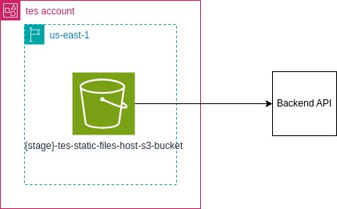

# TES - Test Environment Sector
# Frontend
## Descrição
O TES é uma plataforma utilizada para criação de ambientes de desenvolvimento na nuvem.

## Documentação
Este é o diagrama AWS da aplicação e inclui os recursos utilizados para o seu desenvolvimento:



Toda a diagramação foi feita utilizando a ferramenta Draw.io e estão disponíveis no arquivo `docs/tes-frontend.drawio`.

## Requisitos
Estes são os requisitos da aplicação:
- [AWS CLI versão 2](https://aws.amazon.com/cli/)

## Implantação
- Autentique a sua AWS CLI.

- Crie a infraestrutura com este comando:
```bash
# A variável STAGE pode ser 'dev' ou 'prod'. O padrão é 'dev'.
export STAGE=dev
aws cloudformation create-stack --stack-name tes-frontend-$STAGE --template-body Frontend.yaml --parameters ParameterKey=Stage,ParameterValue=$STAGE --region us-east-1
```

- Crie um arquivo na raíz do projeto chamado de `env.js`.

- Cole o seguinte conteúdo no arquivo:
```javascript
export const env = Object.freeze({
    TES_API_BASE_URL: ""
})
```

- Configure o objeto `env`. Aqui esta uma descrição:
```text
BASE_URL: URL da api do TES implantada no Backend.
```

- Faça o upload dos arquivos estáticos com este comando:
```bash
aws s3 cp --recursive ./pages s3://$STAGE-tes-static-files-host-s3-bucket/pages && \
aws s3 cp --recursive ./util s3://$STAGE-tes-static-files-host-s3-bucket/util && \
aws s3 cp ./env.js s3://$STAGE-tes-static-files-host-s3-bucket/env.js
```

Para remover execute os seguintes comandos:
```bash
aws s3 rm --recursive s3://$STAGE-tes-static-files-host-s3-bucket && \
aws cloudformation delete-stack --stack-name tes-frontend-$STAGE
```